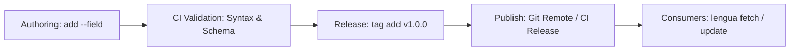

# Storekeeper guide: Managing and publishing organization stores
{: .no_toc }

This guide covers architecture, governance, versioning, and CI/CD validation patterns for **storekeepers** — maintainers responsible for authoring, versioning, testing, and distributing template stores across teams and organizations.

## Table of contents
{: .no_toc .text-delta }

1. TOC
{:toc}

---

## The storekeeper role

A storekeeper designs and maintains repositories of reusable templates for consumers. Key responsibilities include:
1. **Architecture & taxonomy**: Structuring stores, template directories, and frontmatter schemas.
2. **Release management**: Versioning templates using semantic tags (`v1.0.0`, `v2.0.0`, `stable`).
3. **Quality assurance & CI/CD**: Ensuring valid Jinja syntax, complete frontmatter, and non-breaking changes.
4. **Publishing & federation**: Distributing stores across git remotes and maintaining central discovery hubs.



---

## Multi-store repository architectures

Organizations typically choose between two architectural patterns for managing multiple template stores:

### Pattern A: Polyrepo (Dedicated repositories per domain)

Each domain or team maintains its own git repository (e.g. `github.com/acme-org/legal-templates`, `github.com/acme-org/engineering-templates`).

| Advantages | Trade-offs |
|---|---|
| Granular access control and permissions per team | Requires multiple git repositories to track |
| Independent release cycles and commit history | Cross-store updates require separate commits |
| Consumers can adopt only the specific stores they need | |

```bash
# Storekeeper initializes a standalone domain store
lengua init --store ./acme-legal-templates
cd ./acme-legal-templates
lengua add contracts/nda.md --title "Mutual NDA" --field category=legal --field version=1.0 --file nda.md.tmpl
```

### Pattern B: Monorepo (Multiple stores in subdirectories)

All organizational stores live in subdirectories of a single repository (e.g. `templates/legal/`, `templates/engineering/`, `templates/sales/`).

| Advantages | Trade-offs |
|---|---|
| Single place for all organizational templates | Subdirectory imports (`--subdir`) import snapshots without full git history |
| Centralized CI/CD validation across all domains | Permissions apply to the entire monorepo |
| Atomic cross-domain changes | |

---

## Template taxonomy and metadata governance

Standardizing directory layouts and frontmatter schemas ensures templates remain discoverable and maintainable at scale.

### Directory structure best practices

Group templates by domain and purpose:

```
templates/
├── contracts/
│   ├── nda.md
│   ├── contractor-agreement.md
│   └── statement-of-work.md
├── emails/
│   ├── customer-onboarding.md
│   └── password-reset.md
└── rfc/
    ├── architecture-decision.md
    └── security-review.md
```

### Frontmatter schema conventions

`lengua` treats `title` as a first-class field and allows arbitrary key-value pairs via `--field`. For organizational stores, establish standard required fields:

```yaml
---
title: Mutual Non-Disclosure Agreement
category: legal
schema_version: "1.0"
status: approved
author: legal-team@acme.org
audience: external
tags:
  - contracts
  - confidentiality
---
```

Use `lengua add` to author or update templates:

```bash
lengua add contracts/nda.md \
  --title "Mutual Non-Disclosure Agreement" \
  --field category=legal \
  --field schema_version=1.0 \
  --field status=approved \
  --file nda.md.tmpl \
  --message "Release version 1.0 of Mutual NDA"
```

---

## Semantic versioning and release lifecycle

`lengua tag` provides named pointers (`refs/lengua/tags/<template>/<tag>`) scoped to individual templates.

### Releasing template versions

When publishing a template update, tag the commit with a semantic version:

```bash
# Tag the current revision
lengua tag add contracts/nda.md v1.0.0
lengua tag add contracts/nda.md latest

# Make an update and release v1.1.0
lengua add contracts/nda.md --file nda-v1.1.md.tmpl --message "Add jurisdiction clause"
lengua tag add contracts/nda.md v1.1.0

# Move the 'latest' floating tag with --force
lengua tag add contracts/nda.md latest --force
```

### Retroactive tagging

If you committed an update earlier but forgot to tag it, point a tag at a prior commit:

```bash
# Tag the previous commit as v1.0.1
lengua tag add contracts/nda.md v1.0.1 --rev HEAD~1
```

### Auditing and diffing releases

Generate changelogs by inspecting commit logs and diffing between tags:

```bash
# View template history
lengua log contracts/nda.md

# Diff between release tags
lengua diff contracts/nda.md v1.0.0 v1.1.0
```

---

## Automated CI/CD validation pipeline

Before publishing changes to an upstream store, run automated CI/CD checks (e.g. GitHub Actions or GitLab CI) to ensure template health.

### Validation checklist

A storekeeper CI pipeline should verify:
1. **Frontmatter validity**: YAML frontmatter parses cleanly and contains required keys (`title`, `category`, `schema_version`).
2. **Jinja2 syntax validity**: No unclosed `` blocks, invalid filter names, or malformed expressions.
3. **Dry-run rendering**: Templates render successfully with mock variables.

### GitHub Actions CI workflow example

```yaml
name: Validate Template Store

on:
  push:
    branches: [ main ]
  pull_request:
    branches: [ main ]

jobs:
  validate:
    runs-on: ubuntu-latest
    steps:
      - uses: actions/checkout@v4

      - name: Install Rust toolchain
        uses: dtolnay/rust-toolchain@stable

      - name: Install lengua CLI
        run: cargo install --git https://github.com/jprybylski/lengua.git lengua-cli

      - name: Validate all templates
        run: |
          set -e
          echo "Listing all templates..."
          lengua list --json > templates.json
          
          # Iterate over each template and verify frontmatter & rendering
          jq -c '.[]' templates.json | while read -r template; do
            name=$(echo "$template" | jq -r '.name')
            title=$(echo "$template" | jq -r '.title')
            
            if [ -z "$title" ] || [ "$title" = "null" ]; then
              echo "Error: Template $name is missing a title!"
              exit 1
            fi
            
            # Dry-run render to check Jinja syntax
            lengua get "$name" --raw > /dev/null
            echo "✔ $name ($title) is valid."
          done
```

---

## Storekeeper administrative hub & federation

A storekeeper managing multiple team stores can create an **Administrative Hub** library to audit all organizational stores simultaneously:

```bash
# Initialize an administrative inspection hub
lengua init --store ./org-hub --from-repo acme/corp-standards --name corp

# Fetch all other team stores
lengua fetch --store ./org-hub --from-repo acme/legal-templates --name legal
lengua fetch --store ./org-hub --from-repo acme/sales-templates --name sales
lengua fetch --store ./org-hub --from-repo acme/eng-templates --name eng
```

### Benefits of the administrative hub
- **Cross-store search**: Search across all organizational templates in one query (`lengua --store ./org-hub search --field ...`).
- **Collision detection**: Identify unwanted name collisions and shadowing across departments.
- **Inventory export**: Generate structured JSON reports of all active templates in the company.

---

## Distributing coding agent skills (`lengua skills`)

To enable team members and AI coding assistants to seamlessly interact with your template stores, distribute bundled skills:

```bash
# Export skills to agent directories in project repositories
lengua skills .claude/skills
```

This exports `SKILL.md` instructions, empowering agents to accurately query, validate, and render templates following organizational standards.

---

## See also

- [End-user guide]({{ '/end-user-guide.html' | relative_url }}) — for template consumers and downstream workflows
- [Architecture]({{ '/architecture.html' | relative_url }}) — deep dive into store internals and git storage model
- [Commands reference]({{ '/commands.html' | relative_url }}) — full CLI flag reference
